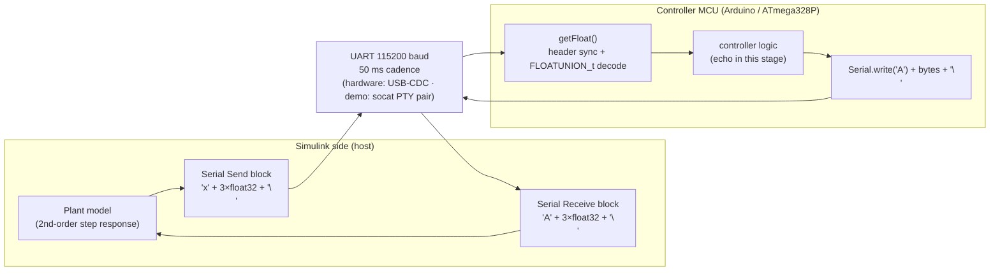
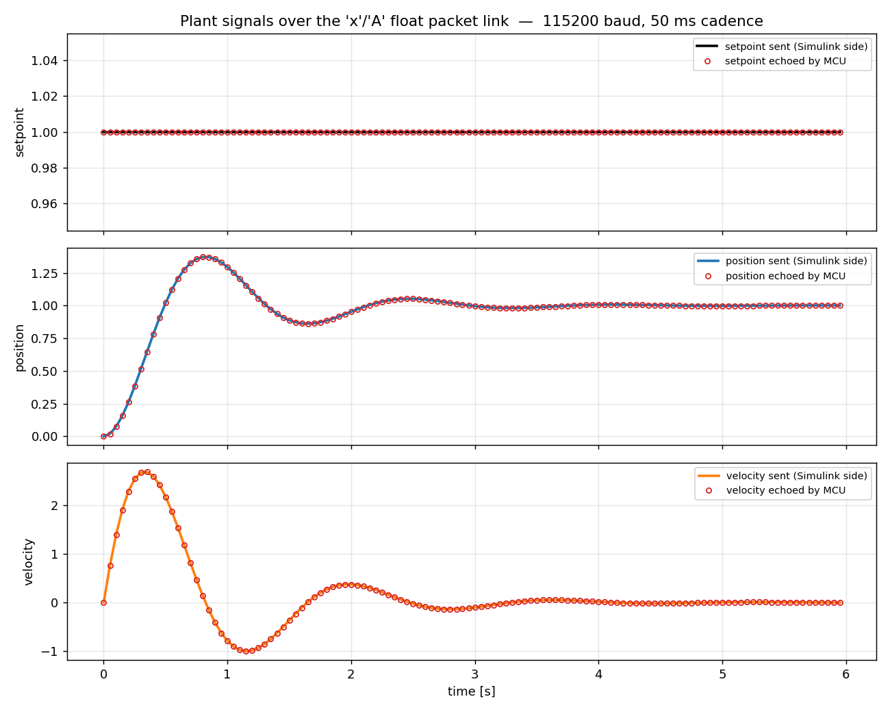
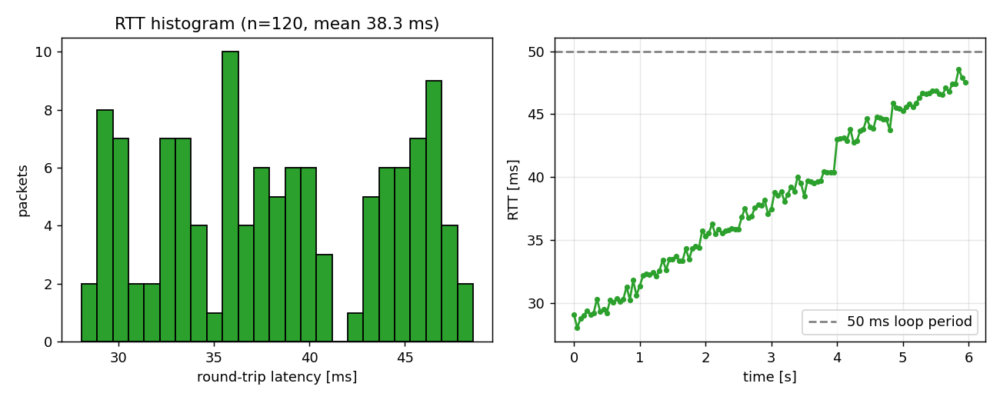
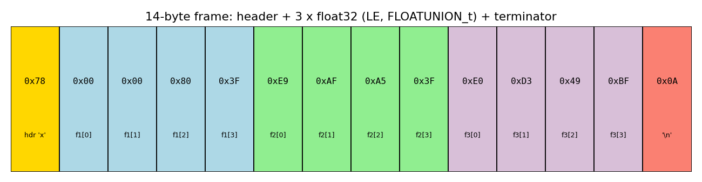

# Demo — Stage 1: Model-Based Design & plant/controller interface

Single entrypoint:

```bash
./demo/run_demo.sh            # ~30 s; artifacts land in demo/out/
DURATION=10 ./demo/run_demo.sh
```

Requirements: Linux, `g++`, `socat`, `python3` with `pyserial` + `matplotlib`, internet on first
run (installs `arduino-cli` + the `arduino:avr` core if missing).

## What runs where

| Step | What | Real vs. simulated |
|---|---|---|
| 1 | `arduino-cli compile --fqbn arduino:avr:uno` of both `.ino` sketches | **Real** target build (ATmega328P `.hex` + size report in `out/firmware_build.txt`). Not flashed — no board attached. |
| 2 | `g++ -include demo/host/arduino_shim.h multiple_send_receive.ino` | **Real, unmodified sketch source**, compiled for the host. The shim supplies only `Serial.{begin,read,write,print,available}` and `delay()`, bound to a tty. |
| 3 | `socat` PTY pair = virtual UART; sketch on one end, `demo/host/simulink_host.py` on the other | **Host-simulated** link and Simulink side. The Python harness implements the exact `'x'`/`'A'` + 3×float32 + `'\n'` protocol and streams an analytic 2nd-order plant response (`wn=4 rad/s`, `zeta=0.3`). |
| 4 | Plots / logs | `out/sent_vs_received.png`, `out/latency.png`, `out/packet_anatomy.png`, `out/packets.csv`, `out/summary.json` |

On hardware the Simulink side is the Instrument Control Toolbox *Serial Send / Serial Receive*
blocks (115200 baud, 50 ms sample time) and the MCU side is the flashed `.hex`. Nothing in
the protocol changes.

## Architecture



## Results from the committed run

See `out/summary.json`: 120 frames sent, 120 echoed, 0 bad frames, 0 float mismatches,
RTT 28–49 ms (mean 38 ms) against a 50 ms loop period.





The monotonic RTT ramp in `latency.png` is the phase of two independent 50 ms loops
(host timer vs. the sketch's `delay(50)` plus its own execution time) drifting — the
reason the Simulink receive block must share the sketch's sample time.
